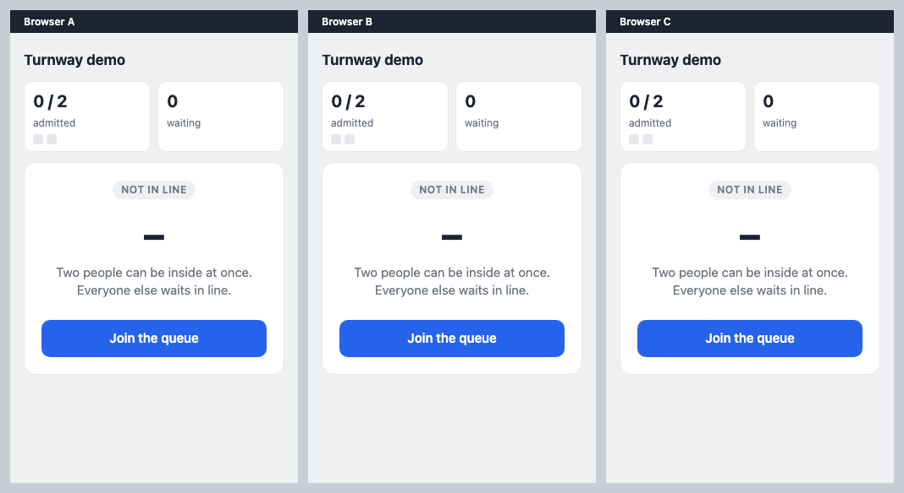

# Turnway

A Redis-backed waiting system for Node.js, provided as a library that manages queues and admits users as capacity becomes available. A NestJS module is included, and a framework-free entry point covers Express, Fastify, Hono, or a plain script.

Users join a queue, check their waiting status, and enter when it is their turn.
Services control how many users are admitted at once, while the waiting system manages the queue and admission lifecycle.
It is intended for ticket sales, course registration, limited product drops, and other services with concentrated demand.



> **Status: library core implemented.** Queue, admission, session lifecycle, and admission
> verification are done and covered by unit and real-Redis integration tests
> (`packages/turnway`). A local load-testing script and a browser demo are available.
> Production failure validation remains incomplete, and the package is not published to npm.

## What it provides

| Capability | Purpose |
|---|---|
| Queue management | Register users and maintain their arrival order |
| Waiting status | Let users check their position and admission status |
| Admission control | Admit users in order, up to the configured capacity |
| Access verification | Verify that a user has been admitted before granting access |
| Session lifecycle | Release capacity when users leave or their sessions expire |

## How it works

```text
Join → Wait → Get admitted → Access the service → Leave or expire
```

1. A user joins and receives a waiting pass.
2. While waiting, the application checks the user's status and sends heartbeats to keep the pass valid.
3. When a slot becomes available, the next user receives permission to enter.
4. The service checks that permission before granting access.
5. Departure or session expiry frees a slot for the next waiting user.

Redis stores queue order and active sessions. The design uses sorted sets to track them
and Lua scripts to update queue and admission state atomically.

Waiting passes expire after 60 seconds by default unless renewed by a heartbeat. Checking status
does not renew a pass. Once an admitted session expires, it no longer counts toward capacity,
even if its stored data has not been cleaned up yet.

## Application responsibilities

Turnway maintains queue order, limits active sessions, and verifies pass ownership and admission.
Each user ID can hold one live pass per room.

Applications are responsible for authentication, bot protection, and preventing abuse through
multiple accounts. Derive `userId` from the authenticated user rather than accepting an arbitrary
ID from the client. Run participation checks before calling `join()`, and call `assertAdmitted()`
before protected work.

See the [package README](packages/turnway/README.md) for setup, session settings, and integration.

## Demo

A NestJS app in `apps/demo` serves a browser page over the module, with capacity 2 and short
TTLs for a local walkthrough. Each browser gets a signed cookie as its user ID, so use different
browsers or profiles to act as different users; private windows of one browser share cookies.
That anonymous cookie is a demo shortcut: in production, take `userId` from your authenticated
session. The cookie secret is random per process, so a restart forgets every user unless
`DEMO_COOKIE_SECRET` (32+ characters) is set.

```sh
pnpm install
pnpm redis:up
pnpm demo              # http://localhost:3000
```

`pnpm demo:record` runs the scenario in the GIF with Playwright, then a simulated Redis outage
(503s must keep the pass and recover to a single polling loop). It rewrites `assets/demo.gif`
only when every check passes. Run `pnpm exec playwright install chromium`
in `apps/demo` first if Chromium is missing.

## Performance

Local runs against one Redis with 500,000 users in the queue, calling the library directly
(no HTTP), one run per configuration on an Apple M4 Pro:

| Workload | 1 room | 30 rooms |
|---|---|---|
| Register 500,000 users | 10.0 s | 10.1 s |
| 25,000 RPS check/heartbeat | p99 9.5 ms | p99 7.0 ms |
| 50,000 RPS check/heartbeat | p99 127 ms, 0 unsent | p99 449 ms, 1.7% unsent |
| 100,000 RPS check/heartbeat | 47% unsent | 51% unsent |

A single Redis saturates near 50,000 RPS here, and 100,000 RPS was not reached. See
[benchmarks](benchmarks/README.md) for the setup, the full tables, what was not covered, and
the raw results.

## Current boundaries

- Capacity is measured in active user sessions, not requests per second.
- A disconnected user may hold a slot until their session expires.
- Admission follows the order in which joins are processed by Redis.
- Targets a single Redis instance. Failure recovery has not been validated, and performance has only been measured locally (see [Performance](#performance)).
